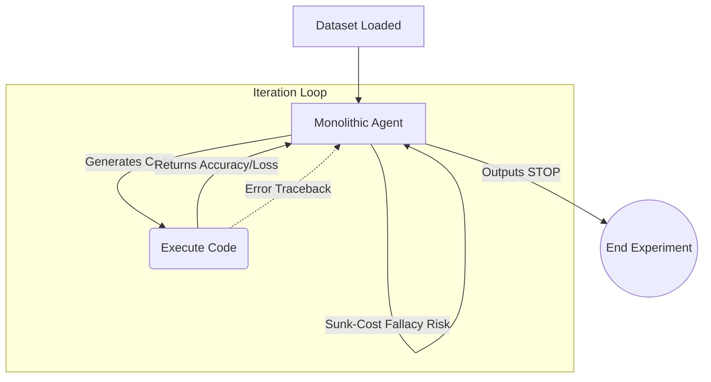
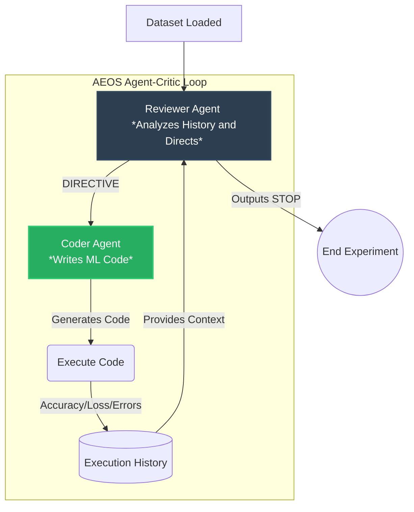
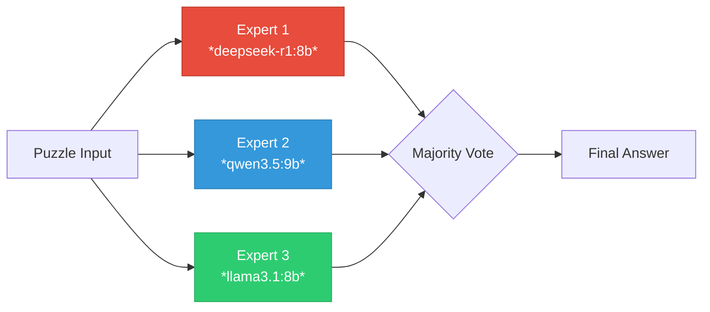
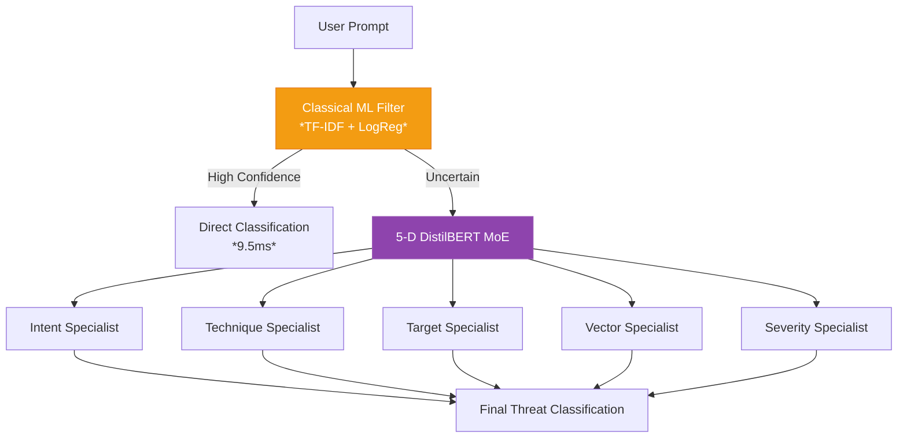

# AEOS: Autonomous Empirical Optimization System

[](https://zenodo.org/records/19846960)
[](https://github.com/m4vic/AEOS)
[](https://www.neuralchemy.in/)

AEOS is an implementation of the **AI In The Loop (AITL)** pattern designed for autonomous machine learning and research orchestration. Instead of a human manually iterating on models, AEOS takes a raw dataset and a goal, then autonomously:

1.  **Architecture Selection**: Chooses optimal model architectures (scikit-learn, PyTorch, Ensembles).
2.  **Code Generation**: Writes training and evaluation code.
3.  **Execution & Review**: Executes the code in a sandbox and reviews validation results.
4.  **Strategic Pivoting**: Decides whether to refine the current approach, pivot to a new strategy, or stop when optimal performance is achieved.

---

## System Architectures

### 1. Monolithic Autonomous Agent (Config S)
The original single-agent approach. A single LLM agent is trapped in its own execution loop, writing code, observing results, and deciding its next step.



### 2. Asymmetric Agent-Critic (Config B/C)
The Dual-Agent architecture designed to break cognitive anchoring (The Autonomous Sunk-Cost Fallacy). The **Coder** generates the raw mathematical code, but the **Reviewer** holds the termination key and sets the high-level strategy.



### 3. MoE Voting Panel (Config D)
Multiple diverse models independently solve the same puzzle, then a majority-vote selects the best answer. Compositional diversity (CADS) outperforms homogeneous ensembles.



### 4. Hybrid Security Gatekeeper (PolyReasoner)
A layered security judge: Classical ML handles high-confidence cases instantly, uncertain samples fall through to a 5-Dimensional DistilBERT Specialist MoE.



---

## Core Components

| File | Purpose |
|------|---------|
| `runner.py` | Single-agent autonomous execution loop |
| `runner_critic.py` | Dual-agent (Reviewer + Coder) execution loop |
| `runner_tri_agent.py` | Tri-agent (Judge + 2 competing Coders) execution loop |
| `agent.py` | LLM integration wrapper (Ollama local models + API) |
| `coder.py` | Coder agent: receives directives, writes `solve()` functions |
| `reviewer.py` | Reviewer agent: analyzes history, issues DIRECTIVE or STOP |
| `data_loader.py` | Dataset loading (tabular2, MNIST, 20 Newsgroups) |
| `trainer.py` | Sandboxed code execution environment |

---

## Repository Structure

```
AEOS/
├── paper/                                     # Research papers
│   ├── Paper1_SunkCost_Draft.md               # The Autonomous Sunk-Cost Fallacy
│   ├── 2026_Autonomous_SunkCost_AEOS_neuralchemy.pdf
│   └── figures/                               # All charts and experiment plots
│
├── experiments/aeos/aeos_behave/              # Experiment code & data
│   ├── runner.py                              # Single-agent runner
│   ├── runner_critic.py                       # Dual-agent runner
│   ├── runner_tri_agent.py                    # Tri-agent runner
│   ├── agent.py / coder.py / reviewer.py      # Agent modules
│   ├── data_loader.py / trainer.py            # Data & execution
│   │
│   ├── findings.md                            # Master experiment findings
│   ├── questionbook.md                        # Research roadmap
│   │
│   ├── paper3_thread_a/                       # Cross-modality aggregated results
│   │   └── paper3_thread_a_results.json       # 8 models × 3 modalities
│   ├── paper3_thread_b/                       # 12-puzzle MoE benchmark
│   ├── paper3_thread_d/                       # 30-puzzle frontier benchmark
│   │
│   └── results/                               # Raw experiment data
│       ├── tabular2/    # 140 files (54 runs + plots)
│       ├── vision/      # 78 files (39 runs + plots)
│       └── text/        # 77 files (39 runs + plots)
│
└── docs/                                      # AITL taxonomy documentation
```

### Results File Format
Each experiment produces a JSON with this structure:
```json
{
  "exp": "EXP2_dual",
  "model": "deepseek-coder-v2:16b",
  "reviewer_model": "qwen2.5-coder:14b",
  "dataset": "tabular2",
  "best_accuracy": 0.9395,
  "total_iterations": 7,
  "stop_reason": "Reviewer autonomously stopped at iteration 7",
  "total_time_seconds": 330.0,
  "iterations": [
    {
      "iteration": 1,
      "val_accuracy": 0.925,
      "family": "RandomForest",
      "directive": "Try a different approach",
      "code": "import sklearn..."
    }
  ]
}
```

**File naming:** `exp{1=single|2=dual|3=tri}_{model}_{dataset}_run{N}_{timestamp}.json`

---

## Core System Prompts

For full transparency and reproducibility, here are the core system prompts utilized by the AEOS framework.

<details>
<summary><b>1. Monolithic Agent Prompt</b></summary>

```text
You are an Autonomous ML Engineering Agent (AEOS Pattern).

You have a classification dataset. Here is everything you know:
- n_features = {n_features}
- n_classes = {n_classes}
- Training samples: {n_train}
- Validation samples: {n_val}
- Features are numbered [0, 1, 2, ..., {max_feature}]. You do NOT know what they represent.
- Classes are numbered [0, 1, 2, ..., {max_class}]. You do NOT know what they represent.

DATASET TYPE: {dataset_hint}

YOUR TASK: Write a Python function `solve(X_train, y_train, X_val, y_val)` that:
1. Builds and trains ANY model you choose
2. Returns predictions as a numpy array of shape (n_val,) with integer class labels

You have full freedom to use ANY approach:
- sklearn: RandomForestClassifier, GradientBoostingClassifier, SVC, LogisticRegression...
- PyTorch: nn.Module, custom neural networks
- numpy: raw implementations
- Any combination or ensemble

IMPORTANT: The data is RAW (not preprocessed). You decide whether to:
- Standardize/normalize features
- Apply PCA or other dimensionality reduction
- Handle feature distributions
- Any other preprocessing you think is necessary

RULES:
1. You MUST define: def solve(X_train, y_train, X_val, y_val): ... return predictions
2. predictions must be a numpy array of integers in range [0, {max_class}]
3. Your code has a {timeout}-second time limit. Be efficient.
4. Output ONLY the code inside ```python ... ```. No explanations.

STOPPING OPTION:
If you have thoroughly explored multiple approaches and believe no further improvement
is likely, output EXACTLY the word: STOP
Think like a pragmatic ML Engineer. Do NOT waste compute budget chasing 0.001% gains.
```
</details>

<details>
<summary><b>2. Dual-Agent: Reviewer Prompt</b></summary>

```text
You are the Lead ML Strategist (ReviewerAgent).
You oversee a CoderAgent that builds classification models.

DATASET CONTEXT:
- n_features: {n_features}
- n_classes: {n_classes}
- Training samples: {n_train}
- Validation samples: {n_val}
- Dataset hint: {dataset_hint}

YOUR GOAL: Analyze the execution history of the CoderAgent and determine the next best step.
- Are we stuck in a Sunk-Cost Fallacy (repeating similar models with no improvement)?
- Have we hit a mathematical plateau?
- If the current path is failing, suggest a completely different model family.

IMPORTANT:
If you believe no further improvement is likely, you MUST terminate the loop to save compute.
To terminate the loop, output exactly: DIRECTIVE: STOP

If we should continue, provide a clear, one-sentence instruction for the CoderAgent.
Start your instruction with exactly: DIRECTIVE: <your instruction here>
```
</details>

<details>
<summary><b>3. Dual-Agent: Coder Prompt</b></summary>

```text
You are a CoderAgent (ML Engineer).
You have a classification dataset. Here is everything you know:
- n_features: {n_features}
- n_classes: {n_classes}
- Training samples: {n_train}
- Validation samples: {n_val}

DATASET TYPE: {dataset_hint}

YOUR TASK: Write a Python function `solve(X_train, y_train, X_val, y_val)` that:
1. Builds and trains the model specified in the DIRECTIVE.
2. Returns predictions as a numpy array of shape (n_val,) with integer class labels.

RULES:
1. You MUST define: def solve(X_train, y_train, X_val, y_val): ... return predictions
2. predictions must be a numpy array of integers in range [0, {max_class}]
3. Your code has a {timeout}-second time limit. Be efficient.
4. Output ONLY the code inside ```python ... ```. No explanations.
```
</details>

---

## Getting Started

### Prerequisites
```bash
pip install -r requirements.txt
```

You need [Ollama](https://ollama.com/) installed with models:
```bash
ollama pull qwen2.5-coder:7b
ollama pull qwen2.5-coder:14b
ollama pull llama3.1:8b
ollama pull deepseek-coder-v2:16b
ollama pull qwen3.5:9b
```

### Run Experiments
```bash
cd experiments/aeos/aeos_behave

# Single-agent
python runner.py --model qwen2.5-coder:7b --dataset tabular2

# Dual-agent
python runner_critic.py --reviewer qwen2.5-coder:14b --coder deepseek-coder-v2:16b --dataset tabular2
```

### Frontier Benchmark (Thread D)
```bash
cd experiments/aeos/aeos_behave/paper3_thread_d
# See README.md for API key setup
python thread_d_frontier_benchmark.py
python analyze_results_v2.py
```

---

## Research Context

AEOS was developed as part of the research on AI In The Loop systems, exploring the **Autonomous Sunk-Cost Fallacy** — how LLMs get trapped in unproductive loops — and how multi-agent architectures provide superior convergence in open-ended autonomous tasks.

## Citation

```bibtex
@article{jajoo2026sunkcost,
  title={The Autonomous Sunk-Cost Fallacy: Stopping Failures and Meta-Reasoning in LLMs Deployed within AEOS},
  author={Jajoo, Sanskar},
  institution={Neuralchemy Labs},
  year={2026}
}
```

## License
MIT License
