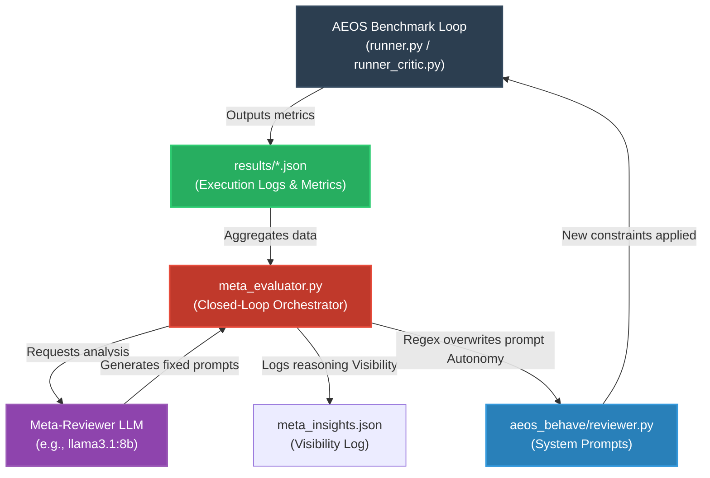

# AEOS Closed-Loop Framework

## Vision
This directory is reserved for future expansion to design a **Closed Loop** system built *on top* of the existing AEOS framework. 

While the current AEOS handles autonomous evaluation (generating, testing, and logging models), the ultimate goal of AITL (AI-In-The-Loop) is to feed these results back into a higher-order system.

## Capabilities
- **Meta-Learning:** Automatically analyzing the `aeos_behave/results/` JSON outputs to identify systemic failure modes across all tested LLMs.
- **Visibility:** Logging the Meta-LLM's reasoning and structural prompt changes to `meta_insights.json` for human oversight.
- **Self-Correction (True AGI Mode):** Overwriting the source code (`reviewer.py`) with updated agent constraints dynamically across subsequent benchmark campaigns without human intervention.

## System Architecture

