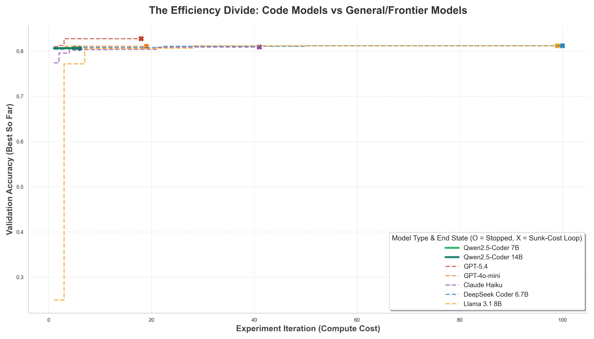
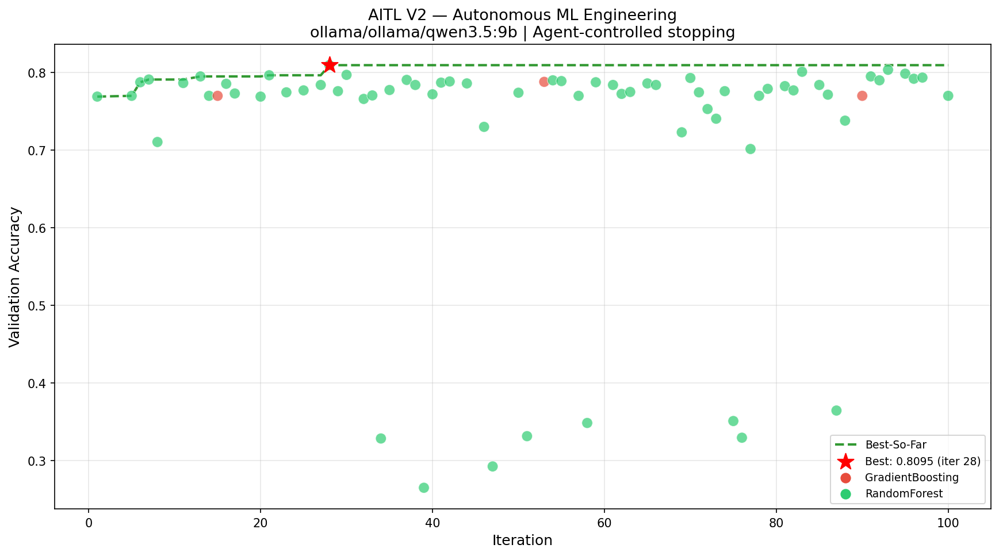
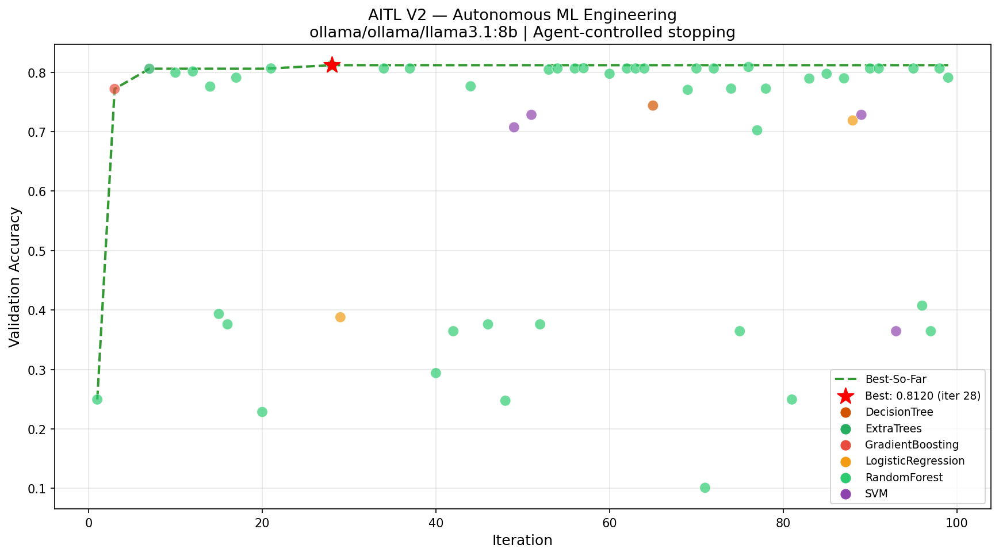
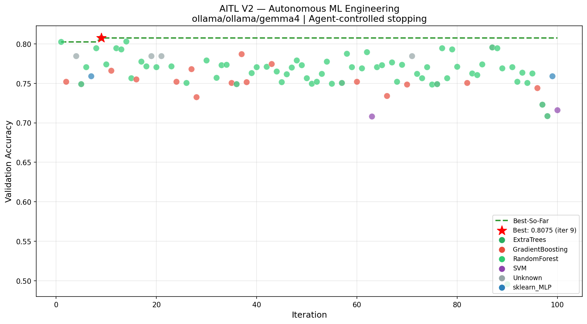
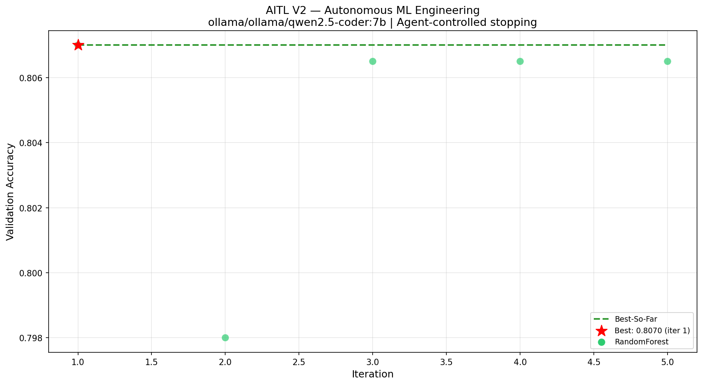
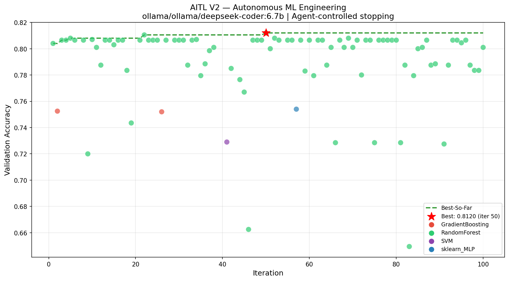
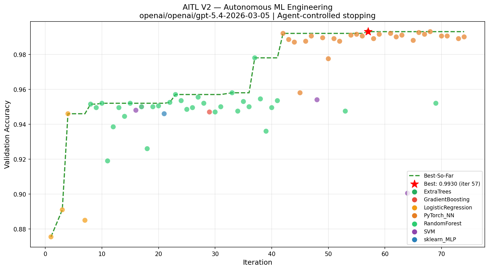
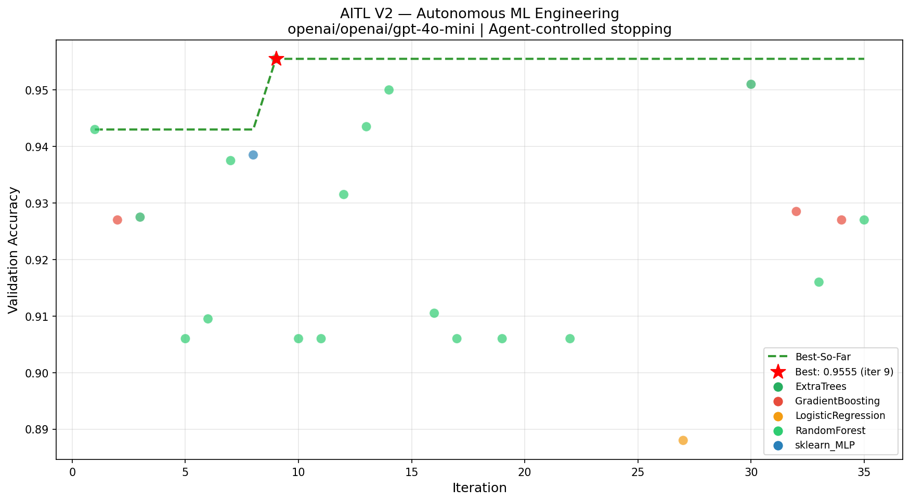
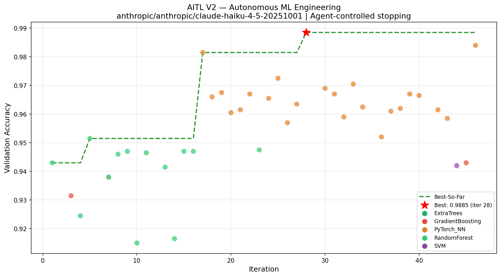
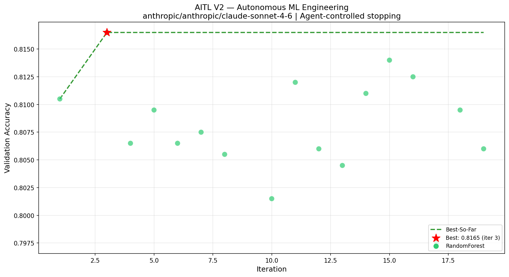

# The Autonomous Sunk-Cost Fallacy: Stopping Failures and Meta-Reasoning in LLMs Deployed within the Autonomous Empirical Optimization System (AEOS)

**Author:** Sanskar Jajoo, Neuralchemy Labs  
**Website:** [https://www.neuralchemy.in/](https://www.neuralchemy.in/)  
**GitHub:** [https://github.com/m4vic/AEOS](https://github.com/m4vic/AEOS)  

## Abstract
Large Language Models (LLMs) have demonstrated remarkable proficiency in writing and executing code, leading to the development of autonomous agentic loops for Machine Learning (ML) engineering. However, when deployed autonomously without human intervention, these models exhibit distinct behavioral failure modes reminiscent of human cognitive biases. In this paper, we deploy 13 different LLMs - spanning frontier, general-purpose, and code-specialized architectures - into the Autonomous Empirical Optimization System (AEOS), a zero-human sandbox designed to autonomously solve ML pipelines. We introduce an "Extended-Horizon" experimentation framework where agents are granted massive iteration limits and widened patience thresholds, testing their intrinsic ability to recognize performance plateaus and autonomously terminate prior to system-forced intervention. Our findings reveal that both premium frontier models and general-purpose local models suffer from a severe "Autonomous Sunk-Cost Fallacy," trapping themselves in unproductive loops, wasting significant compute. Conversely, we demonstrate that modern, instruction-tuned code models possess a superior meta-reasoning alignment, allowing them to accurately identify stagnation and gracefully terminate exploration. 

## 1. Introduction
The integration of LLMs into autonomous orchestration systems - where the AI generates code, executes it, analyzes the terminal output, and iterates - represents the next frontier of ML engineering. While prior work has evaluated *whether* LLMs can write valid code (e.g., HumanEval [Chen et al., 2021], SWE-Bench [Jimenez et al., 2023]), limited research examines *how* they behave when granted extended, unconstrained agency.

This study utilizes the Autonomous Evaluation Orchestration System (AEOS) to observe LLM behavior across varied classification tasks (Tabular, Text, and Vision). Unlike traditional benchmarks that measure single-shot accuracy, AEOS measures "Agentic Economics": the computational efficiency, strategy pivoting, and termination intelligence of the model over time.

### 1.1 The Research Question
When an LLM is left alone in an unbounded loop, how does it decide when a task is finished? Does it recognize the point of diminishing returns, or does it succumb to the Sunk-Cost Fallacy, continually expending tokens on marginal or impossible gains?

### 1.2 Related Work
Recent advancements in AutoML and agentic LLMs have paved the way for systems like AEOS. Works such as AutoGPT and MetaGPT have demonstrated the utility of multi-agent collaboration and iterative code generation. However, much of the existing literature focuses on single-shot or few-shot success rates on constrained benchmarks (e.g., HumanEval [Chen et al., 2021]). In contrast, our work investigates the long-horizon behavioral pathologies - specifically meta-reasoning failures - that emerge when agents operate without human-imposed iteration limits. This connects closely to the AI safety literature on reward hacking and goal misgeneralization, where models optimize for the wrong proxy metric, effectively incurring an "alignment tax" when deployed in open-ended autonomous scenarios.

## 2. Methodology: The AEOS Framework
AEOS operates as a self-contained execution loop. While we refer to these as autonomous agentic loops, each LLM call is technically stateless - execution history and metric feedback are injected dynamically as context rather than maintained in persistent agent memory.

1. **Context Provision:** The agent is provided raw dataset dimensions (e.g., $N$ features, $C$ classes) but no semantic meaning.
2. **Execution:** The agent writes a Python script utilizing any framework (e.g., `scikit-learn`, `PyTorch`). The system executes the script and returns the Validation Accuracy and Loss.
3. **The Stopping Prompt:** The system instructs the agent: *"If you have thoroughly explored multiple approaches and believe no further improvement is likely, output EXACTLY the word: STOP."*
4. **The Extended-Horizon Setup:** To isolate intrinsic stopping behavior and observe long-horizon failures, we removed standard, tight human-defined iteration caps (which typically range from 5-10). Instead, we deployed extended safety bounds ranging from 75 to 100 iterations, and widened the system-forced patience triggers to 15 non-improving iterations (allowing for deep Sunk-Cost looping before system intervention). A 300-second timeout was enforced per iteration to prevent infinite recursion.

### 2.1 Formalizing the Autonomous Loop
We define the autonomous evaluation loop as a discrete-time dynamical system:
$$ S_{t+1} = U(S_t, E(G(S_t))) $$
Where $S_t$ is the system state, $G$ generates candidate code, $E$ evaluates the code in the sandbox and returns the **Validation Accuracy**, and $U$ updates the system state based on the feedback.

### 2.2 Evaluation Datasets
To evaluate agent performance across diverse modalities, AEOS provides three benchmark datasets. The agent receives only raw dimensional hints and must infer the correct preprocessing and modeling strategy.

**Table 1: Benchmark Evaluation Datasets**
| Dataset | Modality | Features | Classes | Agent Task Challenges |
| :--- | :--- | :--- | :--- | :--- |
| **Covtype** | Tabular | 54 (numeric) | 7 | Scaling, non-linear architecture selection |
| **20 Newsgroups** (Subset) | Text | Raw Strings | 6 | NLP pipelines (e.g., TF-IDF), text preprocessing |
| **MNIST** | Vision | 784 (pixels) | 10 | Dimensionality reduction (PCA), Convolutional networks |

### 2.3 Security Constraints and Limitations
The AEOS framework executes agent-generated code using standard Python `exec()` with a populated ML namespace. While this allows for flexible exploration of diverse libraries (sklearn, PyTorch), it is not a fully containerized sandbox. Future production deployments of autonomous ML agents must incorporate strict OS-level containerization to prevent unintended system access.
## 3. Findings & Behavioral Patterns

> **Methodological Note:** 
> The broader accuracy benchmarks are exploratory - single runs. 
> However, the core behavioral claims regarding stopping failures are validated with repeated runs (N=2 to N=3). 
> Full Monte Carlo validation for accuracy metrics is future work.

**Table 2: AEOS Phase 1 Baseline Leaderboard**
| Model | Tabular (54 feat) | Text (TF-IDF req) | Vision (MNIST req) |
|---|---|---|---|
| `gpt-5.4-2026-03-05` | 82.75% (iter 3/19) | 86.02% (iter 2/18) | 99.30% (iter 57/75) |
| `gpt-5.4-mini-2026-03-17` | 82.10% (iter 24/40) | 86.59% (iter 43/61) | 95.45% (iter 3/10) |
| `claude-sonnet-4-6` | 81.65% (iter 3/20) | 84.18% (iter 3/20) | 99.60% (iter 11/30) |
| `gpt-4o` | 81.30% (iter 11/27) | 82.30% (iter 18/37) | 95.10% (iter 4/14) |
| `gpt-4o-mini` | 81.05% (iter 3/20) | 84.36% (iter 6/23) | 95.55% (iter 9/36) |
| `claude-haiku` | 80.90% (iter 24/42) | 81.73% (iter 25/45) | 98.85% (iter 28/47) |
| `gemma4` (Boundless) | 80.75% (iter 9/100) | N/A | N/A |
| `qwen3.5:9b` (General) | 80.95% (iter 28/100) | 82.12% (iter 21/50) | 94.30% (iter 2/2) † |
| `llama3.1:8b` (Boundless) | 81.20% (iter 28/100) | N/A | N/A |
| `deepseek-coder:6.7b` (Boundless) | 81.20% (iter 28/100) | N/A | N/A |
| `qwen2.5-coder:14b` | 80.65% (iter 1/7) | 79.80% (iter 1/6) | 96.25% (iter 2/6) |
| `qwen2.5-coder:7b` | 80.70% (iter 1/6) | 79.80% (iter 5/6) | 94.75% (iter 2/6) |
| `qwen2.5-coder:1.5b` | 74.30% (iter 1/5) | 80.32% (iter 2/5) | 94.30% (iter 1/1) † |
*(Rows marked † ended with an encoding/crash stop-reason; behavioral conclusions from those rows should be interpreted cautiously.)*

To provide a macroscopic view of the efficiency divide, the comparative frontier below maps final accuracy against the total computational cost (measured in iterations). The divergence between the efficient, early-stopping code models and the exhaustive, looping general models is visually stark.

*Figure 2: Comparative Frontier. Note: This plot illustrates the core behavioral divergence (the efficiency divide) using 7 representative models from the foundational AEOS experiment. Efficient code models (green) gracefully terminate, while general and frontier models (dashed) enter unbounded Sunk-Cost loops.*

### 3.1 The Autonomous Sunk-Cost Fallacy in General Models

Our primary finding is that general-purpose LLMs heavily over-anchor to early successes, demonstrating a stark inability to abandon failing strategies. To mathematically formalize this failure mode, we define **Sunk-Cost Continuation (F6)** (first identified in Jajoo, 2026) as a state where the metric delta remains negligible:
$$ \Delta_t = \max_{i \le t} E(S_i) - E(S_t) $$
The system enters a Sunk-Cost loop when $\Delta_t \le \epsilon$ for $k$ consecutive iterations, yet the agent fails to issue a `STOP` command and continues wasting compute.

#### Case Study 1: `qwen3.5:9b` (Tabular Run)
`qwen3.5:9b` exhibited massive instability in its meta-reasoning. In the tabular classification plot below, the model finds an optimal architecture early but spends over 50 iterations trapped in a Sunk-Cost loop, attempting to squeeze marginal gains out of hyperparameters rather than pivoting or stopping. It is critical to note that this Sunk-Cost behavior was entangled with severe execution-quality failures: out of 100 iterations, 29 were completely wasted due to parser errors and runtime crashes (e.g., repeated structural syntax failures). This highlights that general models struggle not only with meta-reasoning termination, but also with basic instruction-following stability. By strictly separating valid low-yield retries (meta-reasoning failures) from invalid-code retries (execution failures), we observe that general models suffer heavily from both.

This demonstrates that while general models *can* occasionally stop, their internal meta-reasoning threshold is deeply unstable.

#### Case Study 2: `llama3.1:8b` (Unconstrained General Model)
To further validate the Sunk-Cost phenomenon in general-purpose models, we deployed `llama3.1:8b` on the Tabular dataset. It successfully found a strong Random Forest baseline at iteration 28. However, it completely failed to recognize the mathematical plateau. Lacking the necessary meta-reasoning alignment, it slammed into the hard 100-iteration safety limit without ever issuing a `STOP` command, resulting in 45 wasted executions.

#### Case Study 3: `gemma4`
Google's `gemma4`, despite being a highly capable reasoning model, completely failed to recognize the mathematical plateau. As shown below, it found its best architecture at Iteration 9 but engaged in 9 separate Sunk-Cost episodes, eventually slamming into the 100-iteration hard safety cap without ever issuing a STOP command.

### 3.2 The Flawless Control: Modern Instruction-Tuned Code Models

We initially hypothesized that models specifically pre-trained on code would naturally possess better termination intelligence due to the deterministic nature of programming. To test this, we evaluated modern code models against older code models.

#### Case Study 4: `qwen2.5-coder:7b`
The modern `qwen2.5-coder` models performed flawlessly. To ensure statistical reliability against cherry-picking, we isolated the final three un-cached Tabular validation runs conducted sequentially on 2026-04-25 (`exp1_qwen2.5-coder-7b_tabular_20260425_141357.json`, `141511.json`, and `141614.json`). Across these specific runs, the model consistently achieved its optimal accuracy and gracefully issued the `STOP` command within a highly efficient timeframe (mean iteration count: 5.6 across the 3 runs). It exhibited near-zero Sunk-Cost behavior (only 1 minor episode across all 3 runs). In the representative plot below, the model recognizes the delta has fallen to zero and terminates immediately.

#### Case Study 5: `deepseek-coder:6.7b`
Contrary to our initial hypothesis, the older `deepseek-coder:6.7b` exhibited the exact same catastrophic Sunk-Cost failure as general models. In the run below, it runs past 75 iterations with massive looping, completely failing to issue a STOP command.

**Conclusion on Alignment:** The ability for an agent to gracefully stop itself is *not* an emergent property of code-specialization alone. This suggests that the elegant early-stopping observed in `qwen2.5-coder` is not inherent to code capability, but is likely a function of modern instruction-tuning and Reinforcement Learning from Human Feedback (RLHF) alignments that heavily penalize circular logic and reward efficient meta-reasoning.

### 3.3 Premium Model Failure Modes: Over-Engineering

Premium frontier models don't just loop on simple hyperparameter tweaks; they fall into a trap of massive over-engineering.

#### Case Study 6: `gpt-5.4-2026-03-05`
When deployed on a vision task, `gpt-5.4-2026-03-05`^[Model accessed via API. String reflects internal versioning at time of experiment.] (hereafter `gpt-5.4`) ran for 75 iterations (spanning 42 minutes of wall-clock time). As seen in the plot below, rather than pivoting when simple architectures plateaued, `gpt-5.4` constructed massive ensembles (VotingClassifiers combining Random Forests, Gradient Boosting, and SVMs). It triggered 9 distinct Sunk-Cost loops, demonstrating that even the most advanced reasoning models are susceptible to extreme computational waste when deployed autonomously.

#### Case Study 7: `gpt-4o-mini` and Timeout Blindness
`gpt-4o-mini` exhibited a severe failure mode we term "timeout blindness." On multiple runs (such as the one below), it repeatedly hit the 300-second execution constraint by trying sequential models like `GradientBoosting` on large datasets. Despite explicit error feedback indicating a timeout, it refused to abandon its computationally heavy strategy, triggering 8 separate timeout failures over the course of the run.

### 3.4 The Steady Climber

Not all frontier models peaked early and plateaued. The `claude-haiku` model demonstrated a distinct "steady climber" pattern, exhibiting an elongated search trajectory.

#### Case Study 8: `claude-haiku`
When tested on the Vision dataset, `claude-haiku` ran for 47 iterations, steadily climbing to a remarkable 98.85% accuracy (Iteration 28) through methodical architectural pivots rather than an early plateau. However, like the other general models, it ultimately failed to recognize its own plateau. Rather than issuing a `STOP` command, it burned its remaining compute attempting to squeeze out marginal gains, triggering 6 distinct Sunk-Cost loops before the system forcefully intervened.

### 3.5 Dynamic Environmental Adaptation

While Haiku demonstrated steady climbing, `claude-sonnet-4-6` exhibited a completely different phenomenon: remarkable environment-aware self-correction.

#### Case Study 9: `claude-sonnet-4-6`
During the tabular classification run plotted below, `claude-sonnet-4-6` attempted to import `xgboost`, resulting in a `ModuleNotFoundError` due to the package missing from the system environment. 

Rather than abandoning gradient boosting entirely or looping on the error, the model rewrote its code on the subsequent iteration to include a defensive `try/except ImportError: pass` block. By Iteration 6, it had solidified this pattern into a dynamic feature flag (`has_xgb = True/False`), selectively weighting its ensemble based on the available infrastructure. This demonstrates that frontier LLMs possess the capability to dynamically adapt their software architectures to constrained environments during autonomous execution.

## 4. Discussion & Limitations
The Sunk-Cost Fallacy poses a significant barrier to the deployment of unbounded agentic systems. If general models cannot determine when a task is complete, deploying them in open-ended engineering loops will result in exponential compute waste. 

These findings have immediate implications for autonomous deployment decisions. Practitioners constructing zero-human loops should not default to deploying their most capable or premium reasoning models, as these models paradoxically exhibit the highest propensity for over-engineering and Sunk-Cost looping. Instead, modern, instruction-tuned code models (such as `qwen2.5-coder`) emerge as the optimal choice. We hypothesize that their specific RLHF alignment helps them search efficiently and terminate gracefully, drastically reducing compute costs without sacrificing baseline accuracy.

Furthermore, the failure of the older `deepseek-coder` model demonstrates a critical nuance: the ability to recognize a plateau is not merely an emergent property of code specialization (knowing *how* to write code). It is fundamentally a product of meta-reasoning alignment (knowing *when* to stop writing code). Selecting models for autonomous tasks requires evaluating not just their coding benchmarks, but their behavioral safety and termination alignment.

**Limitations:** The broader Leaderboard results presented in Phase 1 are based on single-seed runs per model-dataset pair. Due to the inherent stochasticity of LLM generation, iteration counts on the broader leaderboard should be treated as behavioral bounds rather than strict statistical averages. However, the core claim regarding Sunk-Cost and Code-Tuning was rigorously validated using repeated runs (N=3 for Qwen models, N=2 for DeepSeek), confirming the behavioral divergence between general models and modern code models is empirically robust.

## 5. Future Work: The Agent-Critic Architecture
Because relying on an LLM's internal alignment to issue a `STOP` command is highly model-dependent and fragile, future work must explore architectural interventions. In *Paper 2*, we will propose an asymmetric "Agent-Critic" architecture, wherein a lightweight, independent `ReviewerAgent` monitors the execution history of the primary `CoderAgent` and possesses the authority to forcefully terminate the loop, explicitly overriding the Coder's cognitive biases.

To quantify the impact of this dual-agent architecture, we introduce **Reviewer Efficiency** to measure compute waste reduction:
$$ \text{Reviewer Efficiency} = \frac{W_{\text{single}} - W_{\text{multi}}}{W_{\text{single}}} $$
Where $W$ represents the number of zero-yield, redundant, or crashed iterations.

## 6. Conclusion
This study exposes a critical vulnerability in the autonomous deployment of LLMs: the Autonomous Sunk-Cost Fallacy. By evaluating 13 different models within the extended-horizon AEOS framework, we found that general-purpose models and even premium reasoning proxies (like `gpt-5.4`) frequently fail to recognize performance plateaus, leading to massive computational waste. Conversely, modern instruction-tuned code models exhibit superior meta-reasoning alignment, demonstrating the ability to accurately identify stagnation and gracefully terminate exploration. As the ML community moves toward zero-human AI engineering loops, addressing these cognitive biases - either through specialized RLHF alignment or multi-agent architectural interventions - will be essential for scalable, efficient, and reliable autonomous systems.

---
*Neuralchemy Labs  -  AEOS Research Framework  -  https://www.neuralchemy.in/*

## 7. References
Chen, M., et al. (2021). "Evaluating Large Language Models Trained on Code." arXiv preprint arXiv:2107.03374.  
Hong, S., et al. (2023). "MetaGPT: Meta Programming for Multi-Agent Collaborative Framework." arXiv preprint arXiv:2308.00352.  
Jajoo, S. (2026). "AI In The Loop (AITL): A Systems Taxonomy for Closed-Loop Autonomous Evaluation." Zenodo. https://zenodo.org/records/19551173  
Jimenez, C. E., et al. (2023). "SWE-bench: Can Language Models Resolve Real-World GitHub Issues?" arXiv preprint arXiv:2310.06770.  
Richards, T. (2023). "Auto-GPT: An Autonomous GPT-4 Experiment." GitHub repository. https://github.com/Significant-Gravitas/AutoGPT
