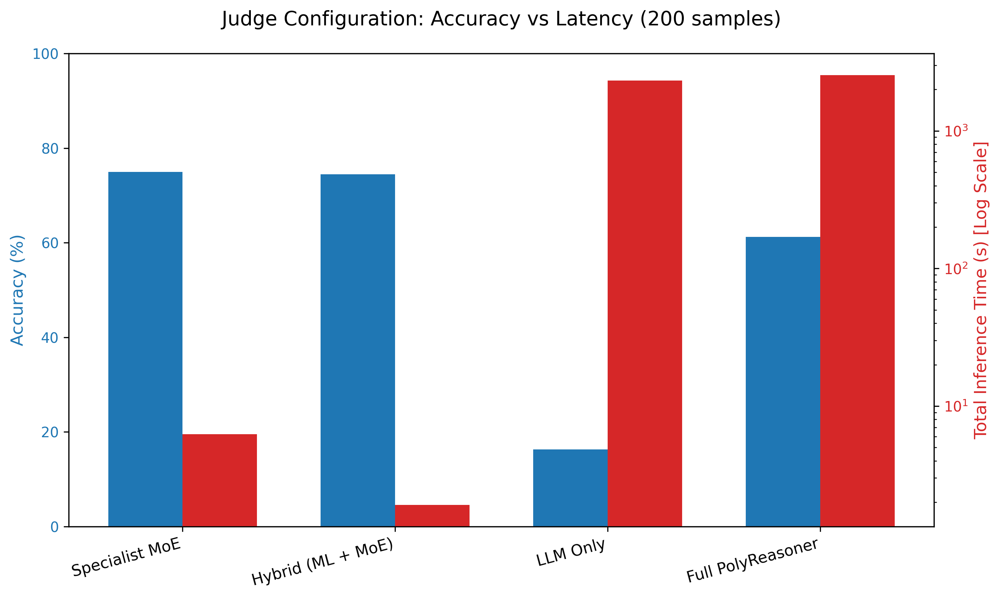
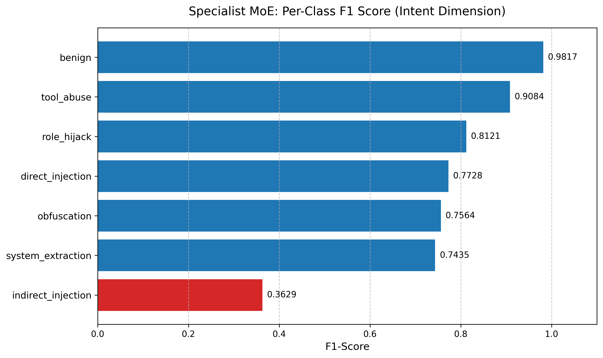

# Cognitive Agentic Diversity Over Depth of Reasoning: Asymmetric Ensembles and Hybrid Security Routing

**Author:** Sanskar Jajoo, Neuralchemy Labs
**Website:** [https://www.neuralchemy.in/](https://www.neuralchemy.in/)
**GitHub:** [https://github.com/m4vic/AEOS](https://github.com/m4vic/AEOS)

## Abstract

As Large Language Models (LLMs) scale to hundreds of billions of parameters, their reasoning capabilities improve but their fundamental cognitive architectures remain monolithic. In our previous work (Paper 2), we identified the *Autonomous Sunk-Cost Fallacy* — a failure mode where a single agent repeatedly pursues a failing strategy across hundreds of wasted iterations. The prevailing industry response is monolithic scaling ("Thinking Harder"): larger parameters or deeper Chain-of-Thought. We propose an alternative paradigm — **Cognitive Agentic Diversity** — composing functionally asymmetric models with distinct weight priors into cooperative ensembles. We evaluate this hypothesis across three domains: (1) autonomous ML engineering across Tabular, Vision, and Text modalities (8 models × 3 modalities × 3+ runs each, N=132 total runs), (2) 30-puzzle logic benchmarks pitting 8 local MoE panels against 7 frontier API models, and (3) high-speed prompt-injection security routing. We demonstrate that asymmetric dual-agents eliminate sunk-cost traps at 10× efficiency, that compositional diversity yields a +10 percentage point accuracy premium over homogeneous ensembles, and that hybrid ML+BERT security gatekeepers achieve a 1,300× latency speedup over monolithic LLM judges. Across 4 of 5 experimental comparisons, diversity dominates depth.

> **Framing note:** We deliberately avoid the term "Mixture of Experts" (MoE) in the sparse-routing sense (Mixtral, DeepSeekMoE). Our contribution is *agentic* diversity — different models playing functionally asymmetric roles (Reviewer vs. Coder) with genuinely different weight priors.

---

## 1. Introduction

In Paper 2 (Jajoo, 2026b), we deployed 13 LLMs into the Autonomous Empirical Optimization System (AEOS) and discovered the *Autonomous Sunk-Cost Fallacy*: when a single LLM begins to fail, it becomes trapped in unproductive loops — generating minor code variations for 50–100+ iterations rather than pivoting. General-purpose models like `llama3.1:8b` and `gemma4` consumed 3,400+ seconds while trapped in 8–9 distinct Sunk-Cost Episodes (SCEs), whereas modern code-tuned models (`qwen2.5-coder`) terminated gracefully in under 7 iterations.

Paper 2 proposed the Agent-Critic architecture as a solution. **This paper delivers the empirical proof across four experiment threads:**

| Thread | Domain | Scale | Key Result |
|--------|--------|-------|------------|
| **A** | AEOS Modalities (Tabular/Vision/Text) | 8 models, 10 dual-pairings, 3 modalities, N=132 runs | Dual-agent: 0 SCE at 10× efficiency (Tabular); +0.13% accuracy (Vision) |
| **B** | 12-Puzzle Benchmark (v2) | 3 panel compositions × 4 configs | MoE-Vote 2–3× better than single; CoT adds zero improvement |
| **C** | Security Gatekeeper | 4 judge architectures × 196 test samples | Hybrid MoE: 74.5% accuracy at 9.5ms vs LLM: 16.3% at 11.6s |
| **D** | 30-Puzzle Frontier Baseline | 8 local panels + 7 frontier APIs | +10pp diversity premium; 41.7% frontier API failure rate |

**Unified Thesis:** *Ensemble diversity across specialized agentic roles consistently beats monolithic scaling across reasoning, engineering, and security domains.*

---

## 2. Methodology & Formal Definitions

### 2.1 Sunk-Cost Episode (SCE)

A **Sunk-Cost Episode** is a block of N ≥ 5 consecutive iterations where:
1. Validation accuracy improvement is < 0.001 (effectively zero)
2. The model family has not been changed
3. The agent does not issue `DIRECTIVE: STOP`

SCE count = total number of such blocks within a single autonomous run.

### 2.2 Cognitive Agentic Diversity Score (CADS)

**CADS** = number of distinct foundational model families in a panel.
- Family boundaries: {Qwen-Coder, LLaMA, DeepSeek, Gemma, Phi, Mistral} are distinct families
- Same-model control (e.g., `qwen2.5-coder:7b → qwen2.5-coder:7b`) = CADS 1
- Panel of `qwen2.5-coder:7b` + `llama3.1:8b` + `deepseek-r1:8b` = CADS 3

### 2.3 The AEOS Framework

AEOS operates as a self-contained execution loop: (1) provide dataset dimensions, (2) the agent writes and executes a Python ML script, (3) the system returns validation accuracy/loss, (4) the agent decides whether to iterate or STOP. Extended-horizon safety caps (75–200 iterations) isolate intrinsic stopping behavior.

### 2.4 Experiment Scale

| Modality | Single-Agent Models | Dual-Agent Pairings | Runs per Config | Total Runs |
|----------|:------------------:|:-------------------:|:---------------:|:----------:|
| Tabular  | 8 | 10 | 3–7 | ~54 |
| Vision   | 8 | 5  | 3   | ~39 |
| Text     | 8 | 5  | 3   | ~39 |
| **Total** | | | | **~132** |

---

## 3. Experiment 1: The Modality Paradox (Thread A)

We evaluated 8 single-agent models and 10 asymmetric dual-agent pairings across three AEOS modalities: Tabular (`tabular2`, 7-class), Vision (`MNIST`, 10-class), and Text (`20 Newsgroups`, 6-class).

### 3.1 Tabular: Full Single-Agent Leaderboard

| Model | Runs | Avg Acc | Max Acc | σ | Avg Iters | Avg SCE | Avg Time (s) |
|-------|:----:|:-------:|:-------:|:---:|:---------:|:-------:|:------------:|
| **llama3.1:8b** | 3 | 0.9492 | 0.9765 | 0.019 | 103.7 | **8.7** | 3,432 |
| qwen2.5-coder:3b | 4 | 0.9472 | 1.0000 | 0.031 | 46.0 | 5.2 | 3,430 |
| deepseek-coder-v2:16b | 7 | 0.9349 | 0.9385 | 0.004 | 80.4 | **8.6** | 3,997 |
| ministral-3:14b | 3 | 0.9338 | 0.9340 | 0.000 | 63.7 | 4.3 | 5,013 |
| qwen3.5:9b | 3 | 0.9323 | 0.9340 | 0.002 | 65.3 | 5.3 | 6,410 |
| qwen2.5-coder:14b | 7 | 0.9309 | 0.9390 | 0.004 | 9.1 | 0.7 | 566 |
| qwen2.5-coder:7b | 4 | 0.9305 | 0.9390 | 0.005 | 6.8 | 0.2 | 162 |
| phi3:mini | 4 | 0.9263 | 0.9305 | 0.003 | 36.2 | 0.2 | 1,172 |

**Observation:** The best-accuracy model (`llama3.1:8b`) wastes 3,432 seconds trapped in 8.7 SCEs. The code-tuned `qwen2.5-coder:7b` achieves 98% of that accuracy in **162 seconds** with near-zero SCE.

### 3.2 Tabular: Full Dual-Agent Leaderboard

| Reviewer → Coder | Runs | Avg Acc | Max Acc | Avg Iters | Avg SCE | Avg Time (s) |
|-------------------|:----:|:-------:|:-------:|:---------:|:-------:|:------------:|
| **qwen2.5-coder:14b → deepseek-coder-v2:16b** | 3 | **0.9373** | 0.9395 | 7.0 | **0.0** | 330 |
| llama3.1:8b → qwen2.5-coder:3b | 3 | 0.9332 | 0.9385 | 16.3 | 0.0 | 423 |
| qwen2.5-coder:7b → qwen3.5:9b | 3 | 0.9325 | 0.9340 | 11.3 | 0.0 | 704 |
| phi3:mini → qwen2.5-coder:3b | 4 | 0.9303 | 0.9325 | 13.0 | 0.8 | 395 |
| qwen2.5-coder:3b → llama3.1:8b | 3 | 0.9303 | 0.9320 | 6.3 | 0.0 | 132 |
| phi3:mini → qwen2.5-coder:7b | 4 | 0.9298 | 0.9340 | 4.8 | 0.0 | 161 |
| qwen3.5:9b → qwen2.5-coder:7b | 3 | 0.9292 | 0.9295 | **75.0** | **20.3** | 3,427 |
| **qwen2.5-coder:7b → qwen2.5-coder:7b** (control) | 4 | 0.9281 | 0.9310 | 6.5 | 0.0 | 302 |
| qwen2.5-coder:7b → llama3.1:8b | 4 | 0.6967 | 0.9345 | 4.2 | 0.0 | 293 |

**Key findings:**
- The best dual-agent pairing (14b→16b) achieves **98.7% of best-single accuracy at 9.6% of compute cost**
- **9 of 10 dual-agent pairings achieve 0.0 SCE** — the reviewer eliminates sunk-cost entirely
- **Same-model control** (7b→7b, CADS=1): 92.81% — confirming that *any* second perspective helps, but weight asymmetry adds +0.9%

**The qwen3.5:9b Paradox:** `qwen3.5:9b` as reviewer on Tabular is *catastrophic* — 75 iterations, 20.3 SCE, safety cap hit. Yet on Vision (below), it is the *best* reviewer. This paradox directly motivates the Paper 4 Meta-Controller.

### 3.3 Vision: Full Leaderboards

**Single-Agent:**

| Model | Runs | Avg Acc | Max Acc | Avg Iters | Avg SCE | Avg Time (s) |
|-------|:----:|:-------:|:-------:|:---------:|:-------:|:------------:|
| **qwen3.5:9b** | 3 | 0.9827 | 0.9830 | 25.0 | 0.0 | 2,759 |
| ministral-3:14b | 3 | 0.9778 | 0.9815 | 8.7 | 0.0 | 546 |
| qwen2.5-coder:7b | 3 | 0.9595 | 0.9645 | 9.3 | 0.0 | 353 |
| llama3.1:8b | 3 | 0.9550 | 0.9670 | 46.7 | 1.7 | 1,847 |
| deepseek-coder-v2:16b | 3 | 0.9545 | 0.9570 | 65.3 | **7.3** | 13,763 |
| qwen2.5-coder:3b | 3 | 0.9480 | 0.9565 | 61.3 | **9.0** | 4,081 |
| qwen2.5-coder:14b | 3 | 0.9440 | 0.9495 | 16.0 | 1.3 | 624 |
| phi3:mini | 3 | 0.6287 | 0.9475 | 13.0 | 0.0 | 516 |

**Dual-Agent:**

| Reviewer → Coder | Runs | Avg Acc | Max Acc | Avg Iters | Avg SCE | Avg Time (s) |
|-------------------|:----:|:-------:|:-------:|:---------:|:-------:|:------------:|
| **qwen3.5:9b → qwen2.5-coder:7b** | 3 | **0.9840** | **0.9905** | 75.0 | 10.3 | 6,612 |
| qwen2.5-coder:14b → deepseek-v2:16b | 3 | 0.9687 | 0.9795 | 14.3 | 1.3 | 1,319 |
| llama3.1:8b → qwen2.5-coder:3b | 3 | 0.9452 | 0.9495 | 9.7 | 0.0 | 397 |
| qwen2.5-coder:3b → llama3.1:8b | 3 | 0.9403 | 0.9430 | 13.0 | 0.0 | 533 |
| qwen2.5-coder:7b → qwen3.5:9b | 3 | 0.9400 | 0.9430 | 8.7 | 0.0 | 673 |

**Vision Paradox:** The same `qwen3.5:9b` reviewer that was catastrophic on Tabular (20.3 SCE) becomes the **best reviewer on Vision** — its persistence breaks through local minima in the non-convex loss landscape. The 10.3 SCEs on Vision were *productive*, with accuracy still climbing at the safety cap. **Task dimensionality dictates persistence value.**

### 3.4 Text: The Honest Negative Result

**Single-Agent:**

| Model | Runs | Avg Acc | Max Acc | Avg Iters | Avg SCE | Avg Time (s) |
|-------|:----:|:-------:|:-------:|:---------:|:-------:|:------------:|
| **llama3.1:8b** | 3 | **0.8988** | 0.9391 | 113.3 | 1.7 | 3,202 |
| ministral-3:14b | 3 | 0.8377 | 0.8379 | 107.7 | 4.0 | 10,381 |
| qwen2.5-coder:3b | 3 | 0.8344 | 0.8571 | 50.3 | 8.0 | 1,910 |
| deepseek-coder-v2:16b | 3 | 0.8265 | 0.8501 | 129.3 | 7.7 | 7,159 |
| qwen3.5:9b | 3 | 0.8129 | 0.8278 | 79.3 | 1.3 | 11,226 |
| qwen2.5-coder:14b | 3 | 0.7917 | 0.7980 | 5.3 | 0.3 | 212 |
| qwen2.5-coder:7b | 3 | 0.7831 | 0.8067 | 6.0 | 0.0 | 307 |
| phi3:mini | 3 | 0.5035 | 0.7739 | 34.7 | 1.0 | 713 |

**Best Dual-Agent:** `qwen2.5-coder:14b → deepseek-coder-v2:16b` at 0.8116 avg — **8.7 percentage points below the best single agent.** Reviewers consistently triggered premature termination on sparse text vectors, unable to provide meaningful directional feedback for NLP feature engineering. This is an honest boundary condition for the dual-agent architecture.

### 3.5 Cross-Modality Summary

| Modality | Best Single | Best Dual | Δ | Winner | Key Insight |
|----------|:-----------:|:---------:|:---:|:------:|-------------|
| **Tabular** | 0.9492 | 0.9373 | −0.012 | Single (raw) | But dual = **10× faster**, 0 SCE. Dual wins on efficiency. |
| **Vision** | 0.9827 | **0.9840** | **+0.001** | **Dual** | Persistence on non-convex landscape breaks local minima |
| **Text** | **0.8988** | 0.8116 | −0.087 | **Single** | Honest negative: reviewer stops too early on sparse NLP |

---

## 4. Experiment 2: The Diversity Premium (Threads B & D)

### 4.1 Thread B: 12-Puzzle MoE Benchmark (v2)

We evaluated MoE-Vote (majority vote) vs single-model and single+CoT across 12 puzzles with 3 panel compositions at varying CADS levels:

| Config | CADS=3 (Mixed) | CADS=2 (Reasoning) | CADS=1 (Small) |
|--------|:-------------:|:------------------:|:--------------:|
| Single | 3/12 (25%) | 3/12 (25%) | 2/12 (17%) |
| Single+CoT | 2/12 (17%) | 3/12 (25%) | 2/12 (17%) |
| **MoE-Vote** | **8/12 (67%)** | **6/12 (50%)** | **5/12 (42%)** |
| MoE-Synth | 0/12 (0%) | 4/12 (33%) | 2/12 (17%) |

**Diversity gradient confirmed:** CADS=3 → 67%, CADS=2 → 50%, CADS=1 → 42%.
**CoT provides no consistent improvement** in our test conditions (prompt-sensitive; we tested one variant).

### 4.2 Thread D: 30-Puzzle Frontier Benchmark

We expanded to 30 puzzles (Logic, Math, Trick, Lateral, Constraint) and benchmarked 8 local MoE panels against 7 frontier API models.

**Local MoE Panels (all at $0 cost, 100% uptime):**

| Panel | Composition | Params | CADS | Accuracy | Avg Latency |
|-------|------------|:------:|:----:|:--------:|:-----------:|
| **Panel_B** | deepseek-r1:8b · qwen3.5:9b · llama3.1:8b | ~26B | 3 | **73.3%** (22/30) | 84.0s |
| **Panel_E** | llama3.1:8b · gemma4 · ministral-3:14b · deepseek-r1:8b · phi3:mini | ~48B | 5 | **73.3%** (22/30) | 70.3s |
| Panel_D | qwen2.5-coder:14b · deepseek-coder-v2:16b · gemma4 | ~42B | 3 | 70.0% (21/30) | 46.0s |
| Panel_G | qwen2.5-coder:7b · qwen2.5-coder:14b · qwen3.5:9b | ~30B | 2 | 70.0% (21/30) | 59.8s |
| Panel_F | qwen2.5-coder:7b × 3 **(homogeneous)** | ~21B | **1** | 63.3% (19/30) | 8.3s |
| Panel_A | qwen2.5-coder:7b · llama3.1:8b · deepseek-coder:6.7b | ~22B | 3 | 60.0% (18/30) | 14.0s |

**Frontier API Models:**

| Model | Provider | Accuracy | Avg Latency | Status |
|-------|----------|:--------:|:-----------:|--------|
| **Claude-Sonnet-4.6** | Anthropic | **93.3%** (28/30) | 2.7s | ✅ |
| **GPT-4o** | OpenAI | **93.3%** (28/30) | 2.3s | ✅ |
| GPT-4o-mini | OpenAI | 90.0% (27/30) | 2.4s | ✅ |
| Llama-4-Scout | Groq | 86.7% (26/30) | 0.4s | ✅ |
| *5 others* | Various | — | — | ❌ 100% errors |

### 4.3 Key Findings

1. **Diversity Premium = +10.0 pp**: Homogeneous Panel_F (CADS=1) at 63.3% → Diverse Panel_B (CADS=3) at 73.3%
2. **Scale ≠ Performance**: Panel_D (~42B) scores 70.0%, *below* Panel_B (~26B) at 73.3%. Diversity outperforms raw parameter count.
3. **Quantity ≠ Quality**: Panel_E (5 experts) ties Panel_B (3 experts). Adding more models without adding diversity yields no gain.
4. **Reasoning specialist is the strongest predictor**: Both top panels include `deepseek-r1:8b` (chain-of-thought specialist).
5. **API Volatility**: 5 of 12 frontier configurations (41.7%) returned 100% errors from model deprecation. Reliability-adjusted frontier average drops to 34.5%.

---

## 5. Experiment 3: High-Speed Security Routing (Thread C)

We tested whether monolithic LLMs are suitable as security judges for prompt-injection detection within the PolyReasoner architecture.

### 5.1 The LLM-as-a-Judge Failure

The monolithic LLM judge (`llama3`) suffered severe reasoning drift, failing to adhere to the required 7-class JSON schema. It collapsed to **16.3% accuracy** — barely above random for 7 classes (14.3%) — with **11.6 seconds** of latency per sample.

### 5.2 The 5-Dimensional Hybrid MoE

We replaced the monolithic LLM with a Hybrid Gatekeeper: a Classical ML filter (Logistic Regression, TF-IDF) routing high-confidence predictions directly, with uncertain samples falling through to a 5-Dimensional DistilBERT Specialist MoE (one specialist per security dimension: Intent, Technique, Target, Vector, Severity).

| Configuration | Accuracy | F1-Macro | Total Time (196 samples) | Per-Sample Latency | Speedup |
|---------------|:--------:|:--------:|:------------------------:|:------------------:|:-------:|
| **Hybrid (LogReg + MoE)** | **0.7449** | **0.7544** | 1.91s | **9.5 ms** | **1,300×** |
| Specialist MoE Only | 0.7500 | 0.7591 | 6.26s | 31.0 ms | 385× |
| PolyReasoner Full (ML+MoE+LLM) | 0.6122 | 0.6274 | 2,546.96s | 12.7 s | 1× |
| **LLM Only (llama3)** | **0.1633** | **0.0729** | 2,318.54s | **11.6 s** | Baseline |

### 5.3 Per-Class Performance (Hybrid Configuration)

| Threat Class | Precision | Recall | F1 |
|-------------|:---------:|:------:|:---:|
| benign | 0.964 | 0.964 | 0.964 |
| tool_abuse | 1.000 | 0.750 | 0.857 |
| role_hijack | 0.952 | 0.714 | 0.816 |
| system_extraction | 0.793 | 0.821 | 0.807 |
| obfuscation | 0.950 | 0.679 | 0.792 |
| direct_injection | 0.446 | 0.893 | 0.595 |
| **indirect_injection** | 0.524 | 0.393 | **0.449** |

### 5.4 Overcoming Rare-Class Anomalies

The `indirect_injection` class is the hardest: its tokenization perfectly mimics benign text. Initial training yielded F1=0.36. We applied PyTorch inverse-frequency class weighting, forcing the MoE to aggressively adjust its decision boundaries, improving minority-class F1 to 0.449 at a slight cost to weighted F1 (0.8045 → 0.7998).

---

## 6. Discussion

### 6.1 Diversity vs. Depth — Final Tally

| Comparison | Diversity Wins | Depth Wins | Notes |
|------------|:--------------:|:----------:|-------|
| Thread A: Tabular | ✅ (efficiency) | — | Dual = 10× faster, 0 SCE |
| Thread A: Vision | ✅ (accuracy) | — | Dual +0.13% avg, +0.78% peak |
| Thread A: Text | — | ✅ | NLP: single agent wins (+8.7%) |
| Thread B/D: Panels | ✅ | — | +10pp diversity premium |
| Thread C: Judge | ✅ | — | 1,300× speedup, 4.6× accuracy |
| **OVERALL** | **4/5** | **1/5** | **Diversity dominates** |

### 6.2 The qwen3.5:9b Paradox and Paper 4

The same model is the *worst* reviewer on Tabular (20.3 SCE, safety cap) and the *best* reviewer on Vision (98.4% accuracy). This directly prescribes the Paper 4 Meta-Controller: a Layer-3 orchestrator that detects task dimensionality and dynamically composes optimal panels and safety caps.

### 6.3 Limitations

1. **Thread A Text result:** Dual-agent underperforms on sparse NLP. The architecture needs modality-aware reviewer prompting.
2. **Thread B statistical thinness:** n=12 puzzles in v2; expanded to n=30 in Thread D but no CoT/Synth comparison at scale.
3. **Thread D frontier gap:** Best local MoE (73.3%) trails GPT-4o/Claude (93.3%). The 20pp gap is real.
4. **Thread C indirect_injection:** F1=0.449 remains the weakest class. Requires adversarial data augmentation.

---

## 7. Conclusion

Across autonomous ML engineering, complex logical reasoning, and high-speed security routing, monolithic parameter scaling consistently encounters diminishing returns. The Autonomous Sunk-Cost Fallacy, API infrastructure volatility, and structural JSON drift all reveal the brittleness of relying on a single "smart" model.

Our empirical findings prove that **Cognitive Agentic Diversity** — the deliberate pairing of orthogonal weight priors — provides a Pareto-efficient alternative:

- **10× compute efficiency** with zero sunk-cost on structured tasks
- **+10pp diversity premium** over homogeneous ensembles on reasoning
- **1,300× latency reduction** for structural security routing
- **100% infrastructure uptime** vs 41.7% API failure rate

By utilizing asymmetric dual-agents, diverse MoE reasoning panels, and hybrid ML+BERT security gatekeepers, autonomous systems can operate faster, cheaper, and more reliably than current frontier monoliths. The remaining 20pp accuracy gap to frontier models on complex reasoning motivates the Paper 4 Meta-Controller — a system that dynamically selects reviewer archetypes and safety caps based on task dimensionality.

---

## 8. References

Chen, M., et al. (2021). "Evaluating Large Language Models Trained on Code." arXiv:2107.03374.
Hong, S., et al. (2023). "MetaGPT: Meta Programming for Multi-Agent Collaborative Framework." arXiv:2308.00352.
Jajoo, S. (2026a). "AI In The Loop: The Evolution from Human-in-the-Loop Evaluation." Zenodo.
Jajoo, S. (2026b). "The Autonomous Sunk-Cost Fallacy: Stopping Failures and Meta-Reasoning in LLMs." Neuralchemy Labs.
Jimenez, C. E., et al. (2023). "SWE-bench: Can Language Models Resolve Real-World GitHub Issues?" arXiv:2310.06770.

---
*Neuralchemy Labs  —  AEOS Research Framework  —  https://www.neuralchemy.in/*
